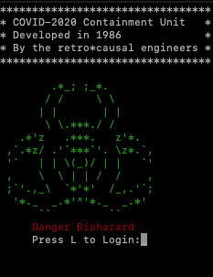

# Capture The Flag COBOL Challenge: Release COVID-2020 

BSides 2020 COBOL challenge - "Release COVID-2020 from containment"




## Introduction

The following is a COBOL based CTF challenge. Post-BSIDES CT 2020 the source code will be released under an MIT license
for anyone who wants to experiement with it and improve it.

The recommended way of running the source code is to use GNUCobol.


## Obtaining GNUCobol and running this project

There are several ways of running and developing against this project.

The first is to simple start the development container. This will install GNUCobol and you can edit 
directly from inside Debian.

The second is to manually install it on your systems. GNUCobol is available on Mac, Windows and Linux.

If you wish to simply run the challenege use the Dockerfile in the root of the repository.

This will create a container with Debian running, the demo private key installed, the environment configured as
a shell and SSH enabled. 


### Docker (for development and the challenge)

Included in this repository is a Dockerfile for building out the project for development and running the challenge.

You can pass in an environment flag `DEV` or `CTF` to build the relevant image.


```
docker build --tag containmentunit:1.0 . --build-arg ENV=DEV
```


### Manual Installation 
The binaries for GNUCobol can be downloaded from sourceforge:

https://sourceforge.net/projects/gnucobol/files/latest/download

Instructions for installation are located in the INSTALL file once downloaded.

In short though the quickest way to install this is:

```
./configure && make && make install
```


#### MacOSX help

You may need to add missing libraries, for example on MacOSX if `gmp` is missing 
use brew to install it

```
brew install gmp

```

If you see the error:

```
configure: error: Unable to extract Berkeley DB version information from db.h
```

When installing GNUCobol make sure you have installed Berkeley DB from brew:

```
brew install berkeley-db4
```

Then run the brew link command:

```
brew link --force berkeley-db4
```

### Compile and Run

To compile the code run:

```
cobc -x -o containment_unit containment_unit.cbl
```

To run the CTF challenge execute:

```
./containment_unit
```

## Programming Guide

If you ae interested in writing code in COBOL using GNUCobol then check out the following site:

https://gnucobol.sourceforge.io/

The programming guide can be found here in PDF format.


## How the challenge works

The player must find out how to unlock the containment unit and release COVID-2020.
COVID-2020 is a bioengineered virus designed to kill of COVID-19. Its engineers traveled
back to 1986 and wrote the COBOL containment unit. The player once completing the sub tasks
unlocks the unit, frees the virus and gets the CTF flag.

### Login

The first step is the figure out how to login.

### Change account expiration

Next they need to set the account expiration to 
12/31/99 by figuring out the substitution cipher

### Set the clock

Finally they need to set the date to 12/31/99.
This then locks in the Y2K date. Once the clock (which is programmable) 
ticks over to Y2K the unit opens.

To set the clock/date in EC2 use the following guide:
https://www.msystechnologies.com/blog/how-to-change-the-date-and-time-on-amazons-ec2-instance/


