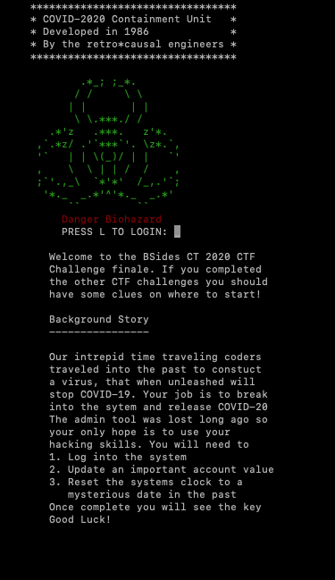

# Capture The Flag COBOL Challenge: Release COVID-2020 

BSides 2020 COBOL challenge - "Release COVID-2020 from containment"




## Introduction

The following is a COBOL based CTF challenge. Post-BSIDES CT 2020 the source code will be released under an MIT license
for anyone who wants to experiement with it and improve it.

The recommended way of running the source code is to use GNUCobol.


## Obtaining GNUCobol and running this project

There are several ways of running and developing against this project.

The first is to simply start the development container. This will install GNUCobol and you can edit 
directly from inside Debian.

The second is to manually install it on your systems. GNUCobol is available on Mac, Windows and Linux.

If you wish to run the challenge use the Dockerfile in the root of the repository.

This will create a container from the image with Ubuntu running, the demo private key installed, the environment configured as
a shell and telnet + ftp enabled. A helper script is provided called build.sh. Replace CTF with DEV to keep a copy of the C and COBOL
source files in the container (see the next section for mroe info). 


### Docker (for development and the challenge)

Included in this repository is a Dockerfile for building out the project for development and running the challenge.

You can pass in an environment flag `DEV` or `CTF` to build the relevant image.

```
docker build --tag containmentunit:1.0 . --build-arg ENV=DEV
```

The only difference between the two is that the C and COBOL source code are deleted with the CTF flag in place.


#### DEV environment 

If you create a DEV environment, to run the container via the commandline execute:

```
docker run -it -p 23:23 -p 21:21 -p 20:20 -p 10090-10100:10090-10100 containmentunit:1.0
```

A copy of the code is located in the container along with a compiled version. However you can git clone your own fork into here too
and work in it, in the container. 

To drop into bash to work on the code, rather than connect to the program itself, use:

```
docker exec -it <container name> bash
```

By default no text editor and dev tools are installed, so you will need to add these. 

#### CTF environment 

If you pass in the CTF flag, then the image will be built out and a container created in CTF mode.

This simulates the production CTF deployment and includes the following:

1. Telnet running in the container: `telnet localhost 23`

2. FTP running in the container `ftp localhost 21`

3. The environment set up so you can Telnet in and connect to the application.


### Manual Installation 
The binaries for GNUCobol can be downloaded from sourceforge:

https://sourceforge.net/projects/gnucobol/files/latest/download

Instructions for installation are located in the INSTALL file once downloaded.

In short though the quickest way to install this is:

```
./configure && make && make install
```


#### MacOSX help

You may need to add missing libraries, for example on MacOSX if `gmp` is missing 
use brew to install it

```
brew install gmp

```

If you see the error:

```
configure: error: Unable to extract Berkeley DB version information from db.h
```

When installing GNUCobol make sure you have installed Berkeley DB from brew:

```
brew install berkeley-db4
```

Then run the brew link command:

```
brew link --force berkeley-db4
```

### Compile and Run (manual or in container)

By default teh application has been hard coded to use the path:

/opt/cu/

The ctf_keys and usrs folder and content will therefore need to be available 
as subdirectories under this. 

You can change this in the source code if you wish. However, this is path used
though in the container, and the location that the user FTPs into, so
keep this in mind if you wish to change the code. You may wish to change the source
and pass the paths in as arguments as well.

Also keep in mind file permissions for /opt/cu on your system, or
you may see errors related to the COBOL program not being able to 
read/write to temporary files it creates during encryption. 

To compile the code run:

```
cc -c decrypt_users.c 
cobc -x -o containment_unit containment_unit.cbl
```

Add ghe binary to /opt/cu and to run the CTF challenge execute:

```
./containment_unit
```


## Programming Guide

If you are interested in writing code in COBOL using GNUCobol then check out the following site:

https://gnucobol.sourceforge.io/

The programming guide can be found here in PDF format.

The encryption/decyption algo was inspired by this site:

https://www.techiedelight.com/des-implementation-c/


## Backstory

In the year 2120 a group of engineers have figued out how to manipulate time. The dystopian world they
inhabit was all a result of the COVID-19 outbreak. The team decide in order to change their present
they must manipulate the past. Knowing that changing time can have unintended consequnces, they 
decide to send information on a bio-engineered anti-virus into the past via telnet. Once the time is right, some smart 
hacker will figure out how to open the vault.

But how can they disguise the virus containment unit and prevent unwanted intruders opening it
too early? The team settle upon an idea. Disguise the anti-viral in a containment unit running on software from 
the 1980's. It was known that COBOL had a date problem and many an individual feared that on Y2K when 
the clock ticked over, systems would crash and meltdown.

The team set up their computer to talk to 1984 and quietly integrated themselves in the world of mainframe pogrammers.
Few at this time knew that the 6 digit date format would provide to be such a problem. Only
on the earliest bulletin boards was the subject under discussion.

Having sent the data to scientists in the past, who ended up placing the results in the containment unit they had to then hack their way and install a bug. A bug that would open the unit at the right time.

One of the engineers had an idea. He would add a hidden debug screen and leave the date stuck before 
December 31st 1999. Everyday date beyond 1999 would reset to that year.
 
Only when the debug screen was enabled, the date reset code disabled and the date set to Jan 1st 2000 
or greater would the containment unit open.

Having coded in the hidden switch, they now had to hope, in 2020 somebody would stumble across
the containment unit! Seeing it was written in the 1980's and following the other clues left 
across puzzles such as it being witten in COBOL and the references to 1999, perhaps some 
skillful hacker would see that the dates had to be manipulated and thus set the vault to trigger a 
Y2K meltdown.

## CTF Text for the platform

Read this closely.

A bsidesct user like you needs to break into the 
containment unit and release the COVID2020 virus
to kill off COVID19. You'll be provided witth an IP address
from there it is up to you.

Remember to read the back story too. 


## How the challenge works

The player must find out how to unlock the containment unit and release COVID-2020.
COVID-2020 is a bioengineered virus designed to kill of COVID-19. Its engineers traveled
back to 1984 through telnet and wrote the COBOL containment unit. The player once completing the sub tasks
unlocks the unit, frees the virus and gets the CTF flag.

### Discover FTP and Telnet

The first step is to discover that FTP and Telnet are running on the IP address provided.
The user may find they can FTP in as anonymous:anonymous but discover the directory is empty.

The clue to what the user is, is in the CTF Text for the platform. The user is: bsidesct

Once they have guessed the FTP user, they can connect and downlaod the info text file 
(which contains the first flag) and the usersdb.txt

If the players connect to Telnet, they will see the containment unit login screen.
Unless they guess the password, they will need to figure out what to do with the 
usersdb.txt file. A clue is provided in the info.txt that the file may be encrypted with DES.

### Crack the file

Next the players have to crack th DES file. They can use the example program we will share in another challenge as a guide.
The program uses a weak key of alternating 1's and 0's.

### Login
Next when they have a login they can gain access to the system. Another flag is hidden in one of the menus.

The user file has a setting that switches on/off debug mode. This uses ROT13. A clue s available in the 
application. If the team tries reloading the user file having not changed it, they will see the debug setting status
rotate from clear text to encrypted. If they spot this, they may be able to discern that ROT13 is in use.
Otherwise they can experiment with the string in the file until they crack it (NYYBJ is the value they need).

### Change account expiration
The debug menu is now available fo them to set the date/clock.

Here they need to set the date to 20000101. This opens the containment unit.
Once open the final key is available.

